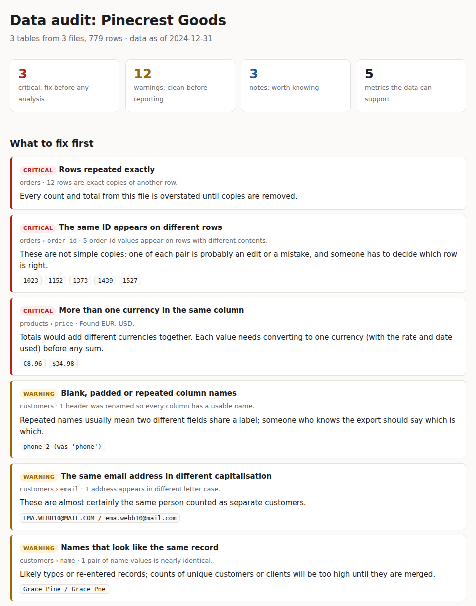

# DataIntake

First-day audit of whatever data a client sends. Point it at a folder of CSV and Excel exports
and get a self-contained HTML report: what each file holds, what is wrong with it in plain
language, how the files connect, and which metrics the data can support.

**Sample audits: [m4dd0ck.github.io/data-intake](https://m4dd0ck.github.io/data-intake/)**
(two small businesses with deliberately messy exports; the raw files are linked next to each audit)



## Why

Every analysis engagement starts with the same question: what did they actually give me? The
answer usually takes a day of opening files by hand. DataIntake does that first pass in seconds
and writes it up so the client can read it too, which makes it useful for scoping ("here is what
your data can answer today, and what needs fixing first") before any work is agreed.

## Usage

Needs Python 3.12+ and [uv](https://github.com/astral-sh/uv).

```bash
uv sync
uv run intake audit ./exports --client "Acme Ltd" --out acme-audit.html --json acme.json
```

```
3 tables, 3 critical, 12 warnings, 3 notes
Report: acme-audit.html  Findings: acme.json
```

Try it on the sample exports:

```bash
uv run intake demo            # writes demo_exports/shop and demo_exports/studio
uv run intake audit demo_exports/shop --client "Pinecrest Goods" --as-of 2024-12-31
uv run intake site            # the Pages site, locally, in site/
```

`--as-of` is the date the data was exported; anything later is flagged as a future date.
`--hide-examples` leaves out example values, for a report that will be shared beyond the client.

## What it checks

| Area | Findings |
|------|----------|
| Structure | title rows above the header, blank or repeated column names, empty columns |
| Missing data | placeholders like `N/A` and `-` typed instead of blanks, mostly empty columns |
| Formats | dates in several formats, numbers stored with symbols or separators, **mixed currencies**, text in number columns, dates saved as Excel serial numbers, labels differing only by case or spacing, stray spaces |
| Duplicates | exact copies, **the same ID on rows that disagree**, near-duplicate names (fuzzy match), emails differing only by case |
| Outliers | values far outside the typical range (3x IQR), negative amounts, future dates, dates before 1990 |
| Relations | likely joins between files (similar names *and* overlapping values), keys with no match on the other side |
| Metrics | which standard KPIs the data supports (revenue and AOV, repeat rate, cohorts, billed vs collected, billable hours...) and the columns that make each possible |

Every finding is rated **critical** (fix before any analysis), **warning** (clean before
reporting) or **note**, and carries an impact line written for the client, e.g. *"Totals would
add different currencies together."*

## How it stays honest

- **Nothing is guessed on load.** CSVs are read as text by DuckDB and Excel cells are converted to
  the text a person sees, so the audit, not the reader, decides what each column holds.
- **The demo is an answer key.** `demo.py` lists every problem planted in the sample exports
  (`PLANTED`) and columns that are clean (`CLEAN_COLUMNS`). The tests fail if any planted problem
  is missed or a clean column is flagged. Current score: 20/20 found, 0 false alarms on the
  clean columns.
- **Safe to send.** The report is one HTML file with inline styles, no scripts and no external
  assets, and every value from the data is escaped.
- **Safe to run on files you did not make.** Symlinks are skipped, sheets that declare absurd
  sizes are read by their real contents, and files over 200 MB, a million rows or 500 columns
  are refused rather than loaded.

## Limits

- CSV and Excel only; no databases or APIs (export them first).
- Rules, not models: near-duplicate detection is fuzzy string matching, KPI suggestions are
  column-shape rules. Both explain themselves, which matters more here than recall.
- Name matching compares up to 3,000 distinct values per column to keep runs fast.

## Project structure

```
src/data_intake/
├── loaders.py      # CSV/Excel as text, header-row detection
├── kinds.py        # what each column holds, value parsers
├── checks/         # structure, missing, formats, duplicates, outliers
├── relations.py    # joins and orphan keys
├── kpis.py         # metrics the data supports
├── audit.py        # runs everything
├── report.py       # HTML + JSON
├── demo.py         # messy sample exports and the answer key
├── site.py         # demo site for Pages
└── cli.py          # intake audit | demo | site
```

## License

MIT
